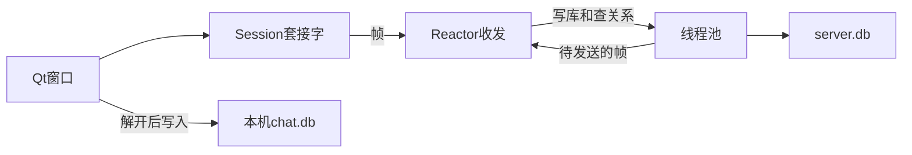
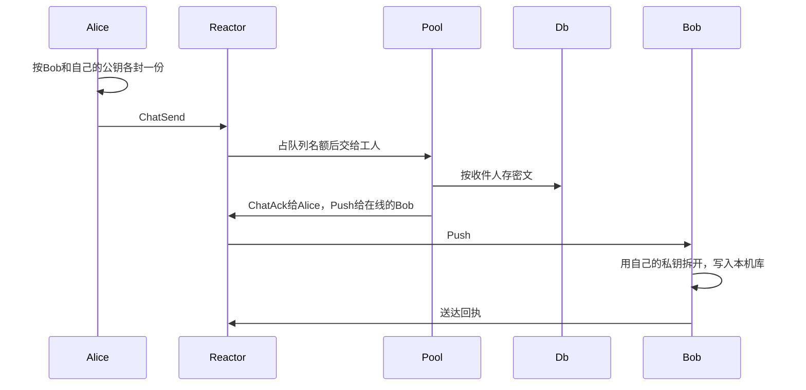

# 端到端加密即时聊天

一个用 Qt 窗口使用的即时聊天程序。注册、登录、加好友、建小群、收发文字都在同一个客户端里完成。

聊天正文在离开本机之前就封好。服务器认人、转发，并把密文存下来，自己打不开这些内容。对方当时不在线，上线后按消息编号把缺的补回来，在自己电脑上拆开。本机保存拆开后的记录，可以按整段包含来搜索，也可以只在本机删掉某一条。

主要功能：

- 注册和登录。同一账号再次登录时，先登录的会被踢下线。
- 按完整用户名加好友。申请发出后，按钮变为灰色的「已发送请求」。删除是双方一起删，系统会各发一句说明。
- 建群、邀请好友、成员退出。只有群主能解散。一个群最多 50 人。
- 消息有编号。离线的信留在服务器上，下次上来补齐。已读位置记在服务器，会话列表用圆点表示还有未读。
- 断线后自动重连。没有聊天时，客户端大约每 15 秒发一次空心跳，服务器约 45 秒收不到任何字节就断开。

在 i9-13900HX（32 个逻辑处理器）上、本机回环、每条消息都写入数据库时，约 100 个连接同时互发，服务器确认写入大约每秒 4000 条，中位等待约 200 毫秒。测法和完整数字在文末。

## 快速开始

需要 Linux、g++ 13、Qt 5、OpenSSL 3，以及系统里的 `libsqlite3.so.0`。压测另需 Go 1.18 或更高。窗口需要桌面环境，WSL 使用 WSLg 即可。

```bash
sudo apt install build-essential g++-13 libssl-dev qtbase5-dev golang-go
make
cd qt_client && qmake && make && cd ..
./srv 8080
./qt_client/qt_chat
```

`./srv` 只听一个端口。数据库默认是当前目录的 `data/server.db`，也可以 `./srv 8080 /某路径/s.db`。服务端日志在 `logs/server.log`。

每个用户在本机的目录是 `~/.local/share/tcp_chat/<用户id>/`：`identity.key` 是私钥，`chat.db` 是解开后的记录，`client.log` 只记失败，合计不超过 1MB。目录还在，历史就还在。换电脑或删掉这个目录后，服务器上的密文解不开。

两个环境变量只作用于服务端：

- `TCPCHAT_IDLE_MS`：多久没有收到字节就断开，默认 45000，小于 1000 的值会被忽略。
- `TCPCHAT_QUEUE_CAP`：每个用户还没写完的消息最多排多少条，默认 64。满了服务器会让客户端稍后再发，这条消息不会入库。


## 技术选型

服务端和客户端协议、加密都用 C++，避免两套帧格式。窗口用 Qt 5 Widgets。密码学用 OpenSSL：登录口令是 PBKDF2-HMAC-SHA256；聊天用 X25519 做临时密钥协商，HKDF 导出密钥，AES-256-GCM 封正文。每个用户一把长期密钥，私钥只在本机；每条消息的盐是当场随机的，和临时公钥一起放在密文前面。

服务端是一条 Reactor 线程加一个线程池。套接字非阻塞，`send` 和 `recv` 只在 Reactor 里调用。核对口令、写库、查好友、给系统说明封信，交给线程池。数据库是单个 SQLite 文件。谁在线、每人还排着多少条写库任务，都放在这个进程的内存里。

没有安装 SQLite 开发头文件时，`common/sqlite3_min.h` 只声明本工程用到的函数，链接系统里的 `libsqlite3.so.0`。

## 模块




帧格式在 `common/protocol.h`：1 字节类型，4 字节大端长度，然后是载荷。粘包和半包都靠这个长度切开。

### 连接和登录

`server/reactor.cpp` 用 epoll 接受连接、读帧、把线程池准备好的字节发出去。新连接还不能发聊天。注册只把用户名、口令哈希和公钥写入 `users`，并建一条和「系统」的会话，不断开会话状态。登录核对口令之后，这条连接才标记为已登录，并写进在线表，随即下发 `LoginOk` 和会话列表。

同一账号再登录时，旧连接先收到一帧「账号在别处登录」，这帧进入发送队列之后再关闭，然后在线表改成新连接。会话列表带只增的版本号，后到的旧列表会被丢掉。

约 45 秒没有任何入站字节就断开。心跳是空帧，不进聊天记录，只为了在没人说话时也有字节到达。

### 端到端

`common/e2e.cpp` 负责封和拆。长期私钥在本机 `identity.key`，服务器只存公钥。发一条消息时，发送方用收件人的公钥做一次临时协商，带上随机盐，再用 AES-256-GCM 封装。服务器把密文原样存进 `message_copies`，不尝试解开。

系统发出的说明（好友申请、同意、互删、邀请、解散）是例外：服务器知道这句原文，再用对方的长期公钥封上，旁人看不懂。用户之间的聊天正文不是这条路径。

### 消息




每条消息有服务器分配的编号。发送方自己带一个 nonce，同一发送者重复提交同一个 nonce 时，服务器返回已有编号，不再推一次。对方不在线时，Push 直接丢掉，密文留在库里。对方上线后用 `SyncReq` 带上本地最大编号，服务器每次最多回 100 条更大的密文。

已读回执会把服务器上的已读位置往更大的编号推进。送达回执只转给原发送者。本机删一条只在 `chat.db` 里做记号，不删除服务器上的密文。

写库按用户限流。每人未完成的任务默认最多 64 个，满了立刻回复稍后再发，不入库。线程池完成一条就还一个名额。

### 好友和群

好友按完整用户名查找。申请记在 `friend_requests`。同意后建立私聊会话，两人都是成员。删除时两边都退出这个会话，已写入的消息不删，系统向双方各发一句说明。

群的创建者是群主。邀请对象必须已经是邀请者的好友。群主不能退出，只能解散。解散后成员被移出，历史密文仍在库里。一条群消息要为当前每个成员各封一份，服务器只检查份数和收件人是否都是成员。

### 核心源码

- `common/protocol.h`：每种帧的字段顺序。
- `common/e2e.cpp`：临时密钥、随机盐、AES 怎么封和拆。
- `server/reactor.cpp`：连接上来之后帧怎么分流。
- `server/db.h`：表和每个操作改什么。
- `qt_client/session.cpp`：窗口侧怎么把帧变成信号。
- `qt_client/main_window.cpp`：发送、列表、好友和群。
- `qt_client/store.cpp`：本机正文、发送中的草稿、本机删除。


## 测试和压测

单元测试不启动服务器。集成测试在仓库根目录自己拉起 `./srv`。两条都要在仓库根目录执行：

```bash
make test
./tests/unit_tests
./tests/integration_tests
```

单元测试覆盖帧的粘包、口令哈希、封拆、日志总体积，以及好友、群、消息在 SQLite 里的变化。集成测试覆盖注册、顶号、加好友、收发、补拉、解除好友、建群、邀请、解散和心跳超时。

压测前先单独启动 `./srv`。程序把连接两两配成好友再互发，所以连接数必须是偶数。注册、登录和加好友的时间记为 Setup，不计入速度。速度是之后服务器回 `ChatAck` 的条数除以这段时间。延迟是每一条从发出到收到确认，报告平均、p50、p95、p99。

```bash
make bench
./tests/bench/server_bench 100 1200 128 127.0.0.1 8080 8
```

参数依次是连接数、每人条数、密文长度、地址、端口、每人同时在路上的条数。默认值是 200、20、128、127.0.0.1、8080、8。

下面是 2026-10-03 在本机回环上的三次结果。每一行都单独启动服务器，数据库是空的。机器是 i9-13900HX（8 个性能核、16 个能效核、32 个逻辑处理器）。压测载荷是定长填充字节，服务器只确认写入，不解密。测量段都不含注册和加好友，三次都长于 30 秒。

| 连接 | 每人条数 | 密文 | 同时在途 | 确认速度 | 平均 | p50 | p95 | p99 |
|---|---:|---:|---:|---:|---:|---:|---:|---:|
| 4 | 40000 | 64 字节 | 4 | 3825 条/秒 | 4.2 ms | 1.7 ms | 20.2 ms | 24.4 ms |
| 40 | 3000 | 128 字节 | 8 | 3675 条/秒 | 86.9 ms | 87.6 ms | 106.4 ms | 126.1 ms |
| 100 | 1200 | 128 字节 | 8 | 3608 条/秒 | 220.9 ms | 217.6 ms | 248.5 ms | 310.9 ms |

三次分别确认 160000、120000、120000 条，没有丢。连接数从 4 增到 100，确认速度停在每秒大约 3600 到 3800 条，时间主要花在把密文写入 SQLite。4 个连接时中位延迟是 1.7 毫秒，平均被少量更慢的确认拉到 4.2 毫秒。40 个和 100 个连接时，平均和中位几乎重合。

## 清理

```bash
make clean
cd qt_client && make clean
```

